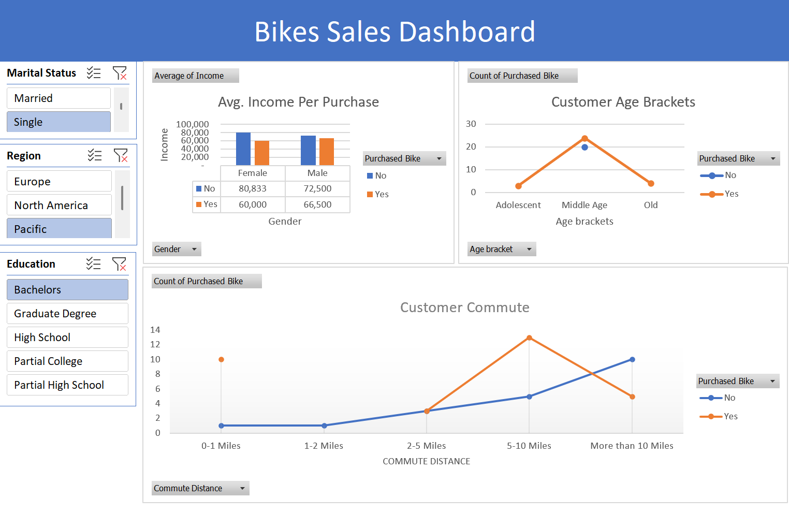

# Bike Sales Dashboard (Excel)

This project is an interactive Excel dashboard created after completing 
Alex The Analyst’s Excel series.

## 📊 Dashboard Preview

## 🧠 Business Questions Answered
- Which age group purchases bikes the most?
- How income impacts bike purchases
- Sales distribution by region and gender

## 🛠 Tools & Skills Used
- Microsoft Excel
- Data Cleaning & Formatting
- Pivot Tables & Pivot Charts
- Slicers for interactivity
- Dashboard layout & design

## 📂 Dataset
Sample bike sales dataset used for learning and practice.

## ▶ How to Use
1. Download the Excel file
2. Open in Microsoft Excel
3. Use slicers to interact with the dashboard

## 📌 Notes
The dashboard is fully interactive once opened in Excel.
